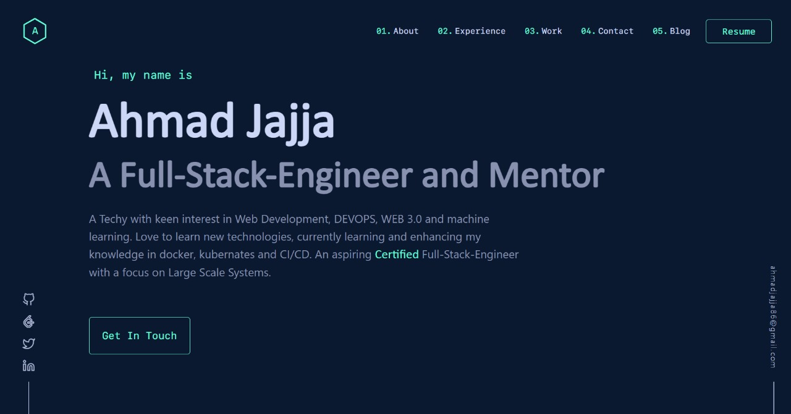

# A Developer Resume.

[![Contributors][contributors-shield]][contributors-url]
[![Forks][forks-shield]][forks-url]
[![Stargazers][stars-shield]][stars-url]
[![Issues][issues-shield]][issues-url]

<div align="center">
  
</div>
<h1 align="center">
  A Developer Resume
</h1>

Yes, you can fork this repo. Please give proper credit by linking back to [github.com/Ahmadjajja](https://github.com/Ahmadjajja) through Star and Fork. Thanks!



## 🛠 Installation & Set Up

1. Install the dependencies

   ```sh
   npm install
   ```

1. Start the react app

   ```sh
   npm start
   ```

## 🚀 Building and Running for Production

1. Generate a full static production build

   ```sh
   npm run build
   ```

## Ongoing work

## Contributing

Pull requests are welcome. For major changes, please open an issue first to discuss what you would like to change.

## License

Distributed under the MIT License. See `LICENSE` for more information.

[contributors-shield]: https://img.shields.io/github/contributors/Ahmadjajja/Developer-Resume.svg?style=for-the-badge
[contributors-url]: https://github.com/Ahmadjajja/Developer-Resume/graphs/contributors
[forks-shield]: https://img.shields.io/github/forks/Ahmadjajja/Developer-Resume.svg?style=for-the-badge
[forks-url]: https://github.com/Ahmadjajja/Developer-Resume/network/members
[stars-shield]: https://img.shields.io/github/stars/Ahmadjajja/Developer-Resume.svg?style=for-the-badge
[stars-url]: https://github.com/Ahmadjajja/Developer-Resume/stargazers
[issues-shield]: https://img.shields.io/github/issues/Ahmadjajja/Developer-Resume.svg?style=for-the-badge
[issues-url]: https://github.com/Ahmadjajja/Developer-Resume/issues
[license-shield]: https://img.shields.io/github/license/Ahmadjajja/Developer-Resume.svg?style=for-the-badge
[license-url]: https://github.com/Ahmadjajja/Developer-Resume/blob/master/LICENSE.txt
[linkedin-shield]: https://img.shields.io/badge/-LinkedIn-black.svg?style=for-the-badge&logo=linkedin&colorB=555
